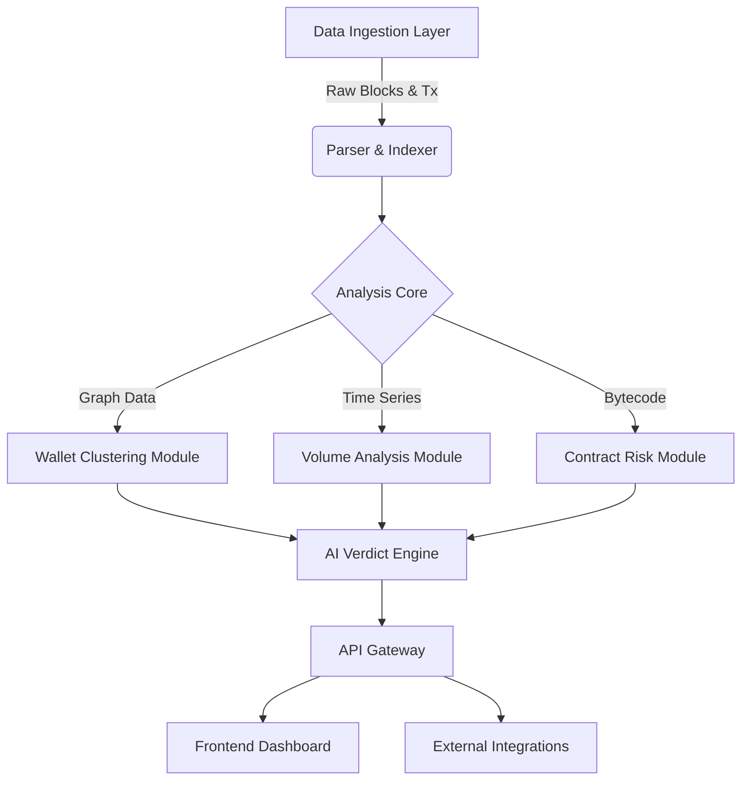

# ChainScore AI

[](https://opensource.org/licenses/MIT)
[](https://www.python.org/downloads/)
[](https://nodejs.org/)
[]()

**Automated On-Chain Intelligence & Risk Assessment Protocol**

---

## 1. Project Overview & Mission Statement

ChainScore AI is an open-source research initiative dedicated to democratizing access to institutional-grade blockchain forensics. Our mission is to bridge the asymmetric information gap between sophisticated market participants and retail investors by providing a transparent, algorithmic, and verifiable trust layer for decentralized finance (DeFi).

We leverage advanced machine learning models, graph theory, and real-time on-chain data ingestion to produce a "Trust Score"—a singular, comprehensive metric that encapsulates the legitimacy and risk profile of newly launched digital assets. ChainScore AI is not merely a tool but a foundational protocol for safer interaction with the blockchain ecosystem.

## 2. Problem Statement

The decentralized nature of permissionless blockchains, while revolutionary, introduces significant risks for the average user:

*   **Opacity of On-Chain Activity:** Retail participants often lack the technical expertise to parse raw compiled bytecode or trace complex transaction graphs.
*   **Sophisticated Manipulation:** Malicious actors utilize automated scripts to generate artificial volume (wash trading), spoof liquidity, and obfuscate fund provenance through mixer contracts.
*   **Speed of Exploitation:** Manual due diligence is insufficient against high-frequency rug pulls and liquidity extraction attacks which occur within blocks of token generation.

ChainScore AI addresses these systemic vulnerabilities by automating the due diligence process, providing real-time, interpretable verdicts that empower users to make informed decisions without requiring deep technical knowledge.

## 3. Features

Our system integrates multiple analytical modules to provide a holistic assessment:

*   **Graph-Based Wallet Clustering:** Identifies Sybil attacks and developer-linked wallets by analyzing transaction topology and funding sources.
*   **Volume Authenticity Analysis:** Distinguishes between organic market movements and algorithmic wash trading patterns using statistical anomaly detection.
*   **Smart Contract Risk Heuristics:** Static and dynamic analysis of bytecode to detect malicious functions (e.g., `mint`, `blacklist`, `owner_withdraw`, `fake_renounce`).
*   **The "Verdict" Engine:** A proprietary ensemble model that synthesizes data from all modules to generate a final Trust Score (0-100) and a qualitative risk assessment.
*   **Shareable Forensic Reports:** Automatically generates detailed, cryptographic-proof dashboards for investigated tokens, suitable for community sharing.

## 4. High-Level System Architecture

The ChainScore AI architecture is designed for modularity, scalability, and fault tolerance.



### Core Components
1.  **Frontend (React/Next.js):** A high-performance, interactive dashboard for visualizing data and reports.
2.  **Backend (Node.js/Express):** Manages API requests, user authentication, and report storage.
3.  **AI Engine (Python/PyTorch):** The computational heart of the system, running inference on pre-trained risk models.
4.  **Data Pipelines (Apache Kafka/Redis):** Handles high-throughput ingestion of mempool and block data.

## 5. AI Methodology

ChainScore AI utilizes a multi-modal approach to risk assessment:

*   **Data Structure:** We normalize on-chain events into a canonical graph representation where nodes represent addresses and edges represent value transfer or contract interactions.
*   **Feature Engineering:** We extract over 150 distinct features, including Gini coefficients of token distribution, liquidity provider (LP) lock duration, and code similarity scores to known scams.
*   **Interpretation:** Our models are trained on a labeled dataset of historical exploits and legitimate projects. We employ Explainable AI (XAI) techniques to ensure that every Trust Score is accompanied by human-readable reasoning (e.g., "Score reduced by 40 points due to 80% of liquidity being held by 3 associated wallets").

## 6. Example Analysis Output

The system produces a structured JSON report for downstream consumption:

```json
{
  "target_asset": "0x1234...abcd",
  "timestamp": "2024-10-27T14:30:00Z",
  "trust_score": 12,
  "risk_level": "CRITICAL",
  "verdict_summary": "High probability of liquidity extraction mechanism detected.",
  "modules": {
    "wallet_clustering": {
      "cluster_size": 15,
      "developer_holding_pct": 0.45,
      "flag": "sybil_distribution_detected"
    },
    "volume_analysis": {
      "organic_ratio": 0.05,
      "wash_trading_detected": true,
      "anomaly_score": 0.92
    },
    "contract_security": {
      "verified_source": true,
      "ownership_renounced": false,
      "dangerous_functions": ["enableTrading", "setMaxTx"]
    }
  },
  "metadata": {
    "model_version": "v2.1.0-alpha",
    "execution_time_ms": 450
  }
}
```

## 7. Repository Structure

```text
chainscore-ai/
├── contracts/          # Solidity interfaces and test contracts
├── data/               # Datasets and model checkpoints (GitLFS)
├── docs/               # Technical documentation and whitepapers
├── pipeline/           # Data ingestion and normalization scripts
├── src/
│   ├── ai/             # Python-based ML models and inference code
│   ├── api/            # Node.js backend services
│   └── dashboard/      # React frontend application
├── tests/              # End-to-end and unit test suites
├── docker-compose.yml  # Container orchestration
└── README.md           # This file
```

## 8. Installation & Setup

Prerequisites:
*   Node.js v18+
*   Python 3.10+
*   Docker & Docker Compose

### Building the Project

1.  **Clone the repository:**
    ```bash
    git clone https://github.com/chainscore-ai/core.git
    cd chainscore-ai
    ```

2.  **Initialize the Environment:**
    ```bash
    # Install backend dependencies
    cd src/api && npm install

    # Install AI engine dependencies
    cd ../../src/ai && pip install -r requirements.txt
    ```

3.  **Run the System (Docker):**
    ```bash
    docker-compose up --build -d
    ```

4.  **Access the Dashboard:**
    Navigate to `http://localhost:3000` to view the local instance.

## 9. Roadmap

Our development is structured into four distinct phases:

*   **Phase I: Alpha (Current)** - Core infrastructure development, model training on historic data, and internal testing of the clustering, algorithm.
*   **Phase II: Beta** - Public testnet launch, API access for select partners, and community validation of Trust Scores.
*   **Phase III: Public Release** - Mainnet integration, full open-source release of all models, and launch of the retail-facing dashboard.
*   **Phase IV: DAO Governance** - Decentralization of the protocol, where token holders vote on model parameters and risk heuristics.

## 10. Open Source & Transparency

ChainScore AI is built on the philosophy that security tools must be as transparent as the blockchains they analyze. We are committed to:

*   **Code Transparency:** All analysis logic and model architectures are open for peer review.
*   **Data Availability:** We provide sanitized datasets to the research community to foster innovation in on-chain forensics.
*   **Community Collaboration:** We actively encourage contributions from security researchers, data scientists, and developers.

## 11. Disclaimer

**ChainScore AI is a research tool and does not constitute financial or investment advice.** The Trust Score is a probabilistic metric based on historical patterns and on-chain data. It does not guarantee the safety of any asset or the future performance of any token. Users should always conduct their own research. The maintainers of ChainScore AI accept no liability for any losses incurred through the use of this software.

---

*Copyright © 2024 ChainScore AI Research Group. All rights reserved.*
