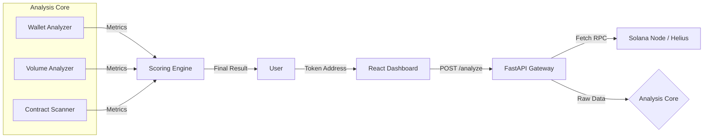

# PumpGuardX System Architecture

## Tech Stack
- **Backend:** Python 3.10+, FastAPI, NumPy, NetworkX
- **Frontend:** React, Framer Motion, Tailwind (CSS)
- **Data:** Helius RPC, Birdeye API (Integration Layer)
- **AI Model:** Proprietary Ensemble Classifier
