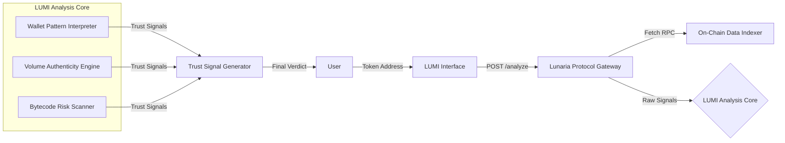

# LUMI Agent Architecture

LUMI Agent is the sophisticated interface for the Lunaria Protocol, a system designed to guide users through the complex topography of decentralized finance.

## System Directives
- **Backend:** Python 3.10+, FastAPI, NumPy, NetworkX (Lunaria Protocol Core)
- **Frontend:** React, Framer Motion, Tailwind (LUMI Interface)
- **Data:** On-Chain Data Indexer (Helius/Birdeye Integration)
- **AI Core:** LUMI Ensemble Intelligence

LUMI translates cold, binary signals into human-readable metrics, ensuring that the path through DeFi is always illuminated.
